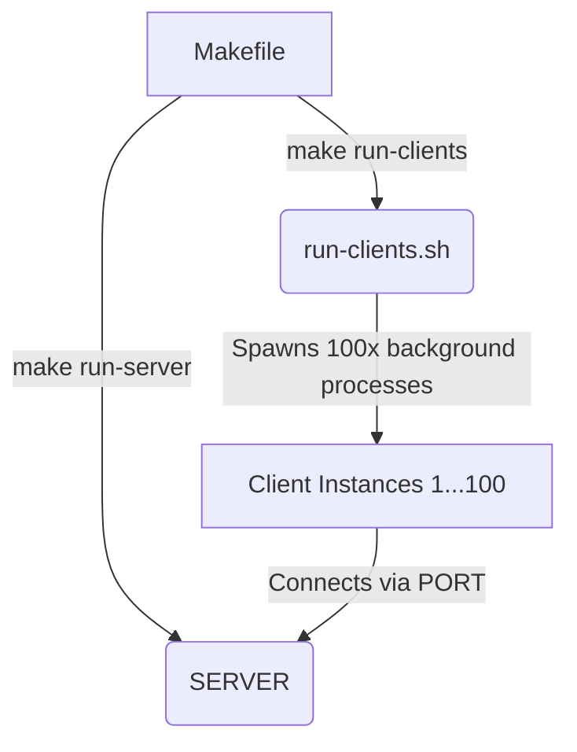

# Client-server-application

A lightweight, concurrent client-server architecture built using Kotlin. The project features an automated Bash testing environment capable of launching 100 non-interactive client instances simultaneously to perform random operations against a central server. The entire lifecycle is managed via an optimized root-level `Makefile`.

## Architecture & Concepts

The system consists of two independent modules:
* **SERVER:** A multi-threaded engine that listens on a specified port, processes incoming operations from clients, and manages data payloads.
* **CLIENT:** A standalone utility that connects to the server to send commands. In non-interactive mode, it executes specific payloads based on commands sent from the terminal.

## Prerequisites

Ensure you have the following installed on your Linux environment:
* **Java JDK 17** or higher
* **GNU Make**
* **Bash Shell** (Standard on Ubuntu/Debian distributions)

## Build and run

Follow these steps to build and run the simulation:

### 1. Build the Entire Project
`make`

### 2. Start the Server
`make run-server`

To run the server on a custom port, pass the SERVER_PORT environment variable: `SERVER_PORT = 8080 make run-server`.

### 3. Launch Clients
If you want to run 100 automated clients type: `make run-clients`.

If your server is on a custom port, match it here: `SERVER_PORT=8080 make run-clients`.

If you want to run as a single client you have 2 choices:
* Interactive mode: `./gradlew run --args="<PORT>"`, which will open a menu that waits for input
* Scriptable mode: `./gradlew run --args="<PORT> <COMMAND NAME | COMMAND NUMBER> [ADDITIONAL ARGUMENTS]"`, which will only print the output directly to the terminal

### 4. Cleanup
To wipe out all Gradle build directories, compiled classes, and generated .jar binaries from both sub-projects, run: `make clean`

## System Architecture Graph

